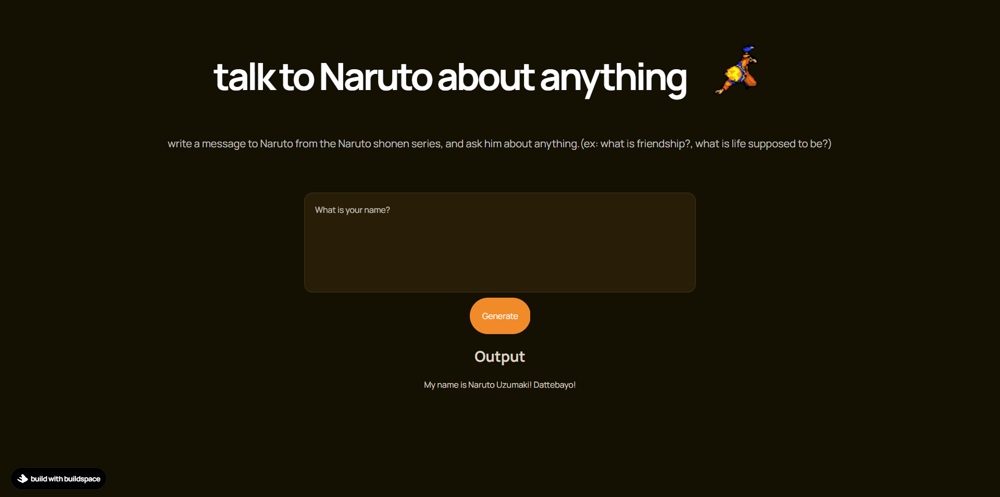

# Naruto with GPT
### Konnichiwa👋
Deployed with Railway: https://naruto-with-gpt.up.railway.app/ 

Tried to do something fun with the OPENAI API to GPT-3. It is not perfect, so expect some janky inconsistent replies!

## What it does?
The website takes prompt as an input from the user (you), and clubs it with an already programmed base prompt -> sends it to the OpenAI API -> Makes use of GPT to get response -> displays the result to the user
The idea is not too complex, the sole magic to make GPT act like Naruto lies in the base prompt that is already set. The base prompt in turn is not too complex either. Personally, I feel it can be made better in future renditions. Feel free to fork and adjust the base prompt as to your liking.

It is not perfect, so expect some janky inconsistent replies!

**Home Page Image**


## ToDos before running on your localhost:
- Create a .env file: Create a .env file with your OpenAI API Key. Refer to the .env.example file. Set OPENAI_API_KEY=_API_KEY_
- Run the following `yarn` commands
```
# install next if you don't have it
yarn add next react react-dom

# run it
yarn dev
```

---
## built with buildspace
This project was possible because of buildspace and their build idea of a GPT-3 Writer. 
Checkout [their website.](https://buildspace.so/builds)
